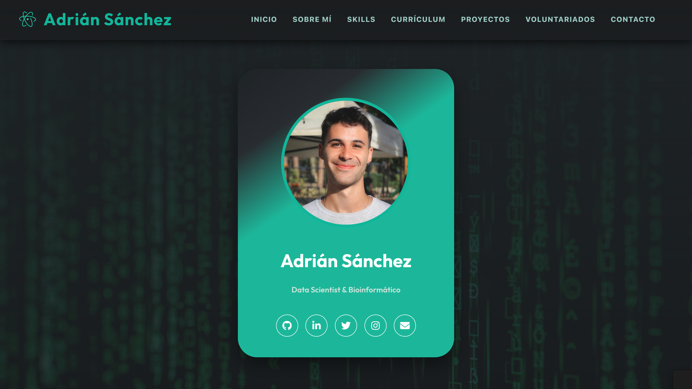

# 🌟 Portfolio de Adrian Sanchez Carrion

  

¡Bienvenido a mi **portfolio personal**! 👋  

Este repositorio contiene mi sitio web personal, donde presento de forma interactiva y visual mi **experiencia profesional**, **formación académica**, **proyectos**, **habilidades** y **voluntariados**. Está diseñado para mostrar quién soy, qué hago y cómo trabajo, combinando un estilo limpio y moderno con animaciones y recursos visuales que facilitan la navegación.  

 

---

## 💻 Sobre este repositorio

Aquí encontrarás todos los archivos necesarios para que mi portfolio funcione correctamente:

- `index.html`: página principal del portfolio.  
- `resources/`: carpeta con todos los recursos visuales, documentos, proyectos, imágenes y scripts que se usan en la web.  
- `script.js` y `styles.css`: archivos que controlan la interactividad y el estilo del sitio.  
- Documentos PDF de mi **currículum**.  
- GIFs y capturas de mis **proyectos** y **voluntariados**.  

Este repositorio está pensado para que cualquiera pueda ver el portfolio en acción, descargarlo o incluso usarlo como inspiración para su propio sitio personal.

 

---

## 🌐 Explora mi portfolio

Te invito a que visites mi portfolio en vivo y descubras todo mi trabajo:  

[**Ver mi portfolio**](https://adrichez.github.io/spanish-portfolio/)  

Allí podrás ver secciones como:  

- **Sobre mí**: un resumen de mi perfil profesional y mis intereses.  
- **Habilidades**: técnicas y profesionales, con barras de progreso visuales.  
- **Currículum**: experiencia laboral y formación académica, incluyendo estudios internacionales y programas de intercambio.  
- **Proyectos**: trabajos destacados con animaciones y descripciones de cada uno.  
- **Voluntariados**: experiencias en proyectos sociales y culturales en España e Italia.  
- **Contacto**: formulario directo y mi información para que podamos conectar.  

 

---

## 🚀 Tecnologías y herramientas

Mi portfolio está construido con tecnologías web modernas y de fácil mantenimiento:  

- **HTML5, CSS3 y JavaScript**  
- Animaciones e interactividad para mejorar la experiencia del usuario  
- Estructura modular para poder actualizar proyectos, documentos y secciones fácilmente  

 

---

## 🤝 ¡Conectemos!

Si quieres contactar conmigo:  

- 📧 Email: [asanca33@gmail.com](mailto:asanca33@gmail.com)  
- 📞 Teléfono: [+34 673 49 99 51](tel:+34673499951)  
- 📍 Ubicación: Granada, España  

También puedes usar el **formulario de contacto** en la web para escribirme directamente.  

 

---

> Este portfolio es un reflejo de mi trabajo, mi formación y mis proyectos.  
> ¡Gracias por visitarlo! 💜  
